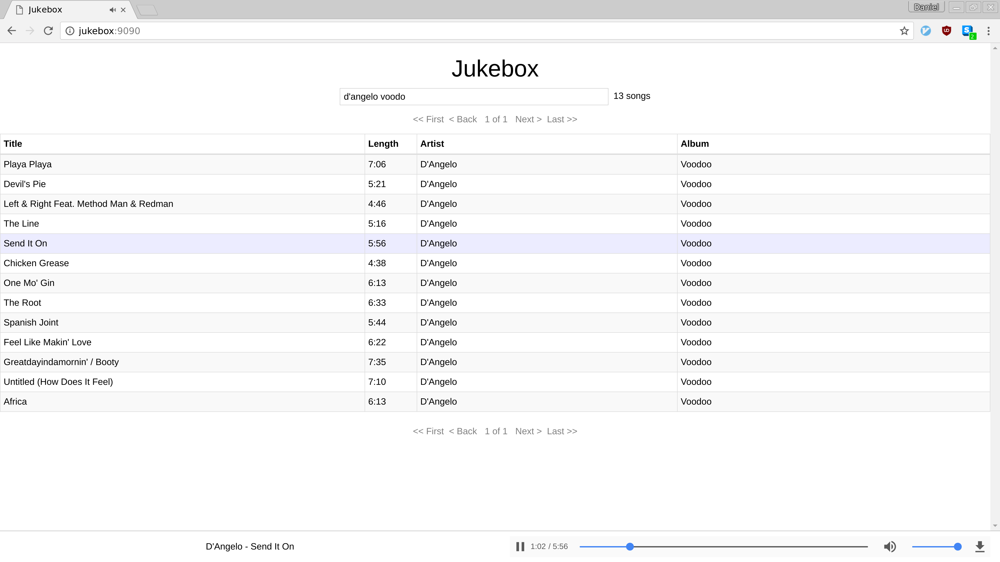

# Jukebox

Jukebox shares your iTunes library through the browser so that you can listen on different devices without needing an iTunes client installed on them.  Unfortunately it's not able to play DRM protected audio files, so any files you bought on the iTunes store won't be playable.





## Installing

```
pip install -r requirements.txt
python setup.py install
```

Copy your iTunes library XML file to itunes_library.xml in the repo directory or, change `ITUNES_FILE` in db_helper.py to a different path and copy it there.

```

python db_helper.py init
```

Then deploy or run the app however you like and visit the site in your browser.
